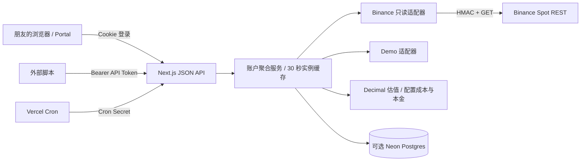

# 架构

## 模块

- `src/components/portal.tsx`：登录、4 个页面、图表、筛选及 CSV 导出。只消费内部 API。
- `src/app/api/`：统一鉴权、同源校验、独立 Cron 鉴权，返回脱敏错误。
- `src/lib/config.ts`：环境变量校验，真实模式必须有密钥和访问保护。
- `src/lib/auth.ts`：常量时间比较、签名 Cookie、API Token 和 Origin 校验。
- `src/lib/binance.ts`：只读 GET、服务端 HMAC、时间偏差同步、查询时限、局部失败标记。
- `src/lib/portfolio.ts`：Decimal 金额计算、交叉报价、未知行情与成本处理。
- `src/lib/service.ts`：适配器聚合、缓存、快照读写、客户端安全数据模型。
- `src/lib/storage.ts`：Neon 参数化 SQL，按账户/环境/API Key 指纹隔离，幂等写入。
- `src/lib/types.ts`：标准化 Holding、Trade、Order、Dashboard，可用于新增交易所。

## 更新与存储

页面每 60 秒调用 `POST /api/sync`；不可见时暂停。后端每实例最多合并 30 秒内的聚合请求，不提供跨实例共享缓存。持仓估值与交易所请求不构成原子快照，价格/余额可能有短暂时间差。

Binance 适配器总查询预算约 40 秒，每个 HTTP 请求最多 10 秒。成交两路并发，超时则报告未同步交易对。数据库单次请求 5 秒超时，失败提示；Vercel route `maxDuration=60`。大量交易对或多个访问者可能增加请求权重，受交易所 IP 限制，应按实际用量调整刷新频率或加入共享缓存。

快照按五分钟时间桶 upsert，只有更新的采集时间能覆盖旧值。不同 API Key 不共用历史；轮换密钥要保留历史时需人工迁移 account scope。查询曲线只采每小时末点，最多约 2160 点，不一次加载所有原始快照。

## 有意限定的第一版范围

单账户、共享查看密码、Binance Spot，环境变量管理凭证。没有多租户账户管理、在线密钥编辑、自动资金流水对账或全历史交易数据库。累计/浮动盈亏依赖人工输入，本版不承诺自动投资业绩核算。

增加 OKX/Bybit 时，新建 provider 返回 `ProviderData`，扩展 config 中数据源选项；不要让前端直接访问交易所。增加自动盈亏前应先落地交易和资金流账本，支持转账去重、手续费币种及历史汇率、期初库存对账，然后决定 FIFO/加权成本算法。
