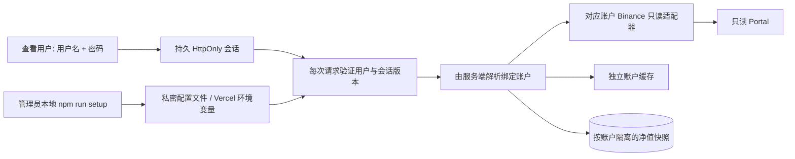

# 多用户账户隔离

- `config-schema.ts` 定义账户与用户 schema，拒绝重复 ID、重复规范化用户名、失效引用及缺密钥的真实账户。
- `config.ts` 从服务端私密 JSON/文件加载，解析单个已授权账户为旧适配器所需 Config；自建配置不继承内置 demo 用户。
- `scripts/manage.mjs` 仅管理员本地执行。交互式隐藏输入密钥与密码，原子写入私密文件，生成 Vercel 导出。密码使用共享 `scripts/password.mjs` 的加盐 scrypt。
- `auth.ts` 签名会话包括用户名、有效期和用户权限版本摘要。每次校验当前用户 enabled、account enabled、密码哈希、绑定及 sessionVersion。成功请求在一天后续期至一年。
- API 路由只把 `authorize(request).config` 交给聚合服务，从不根据查询参数/客户端 Header 选择账户。全局 API Bearer 已移除；Cron 使用独立管理员密钥。
- `service.ts` 按账户 ID / API Key / Secret / 环境 / 交易对建立缓存键；每个账户独立 single-flight Promise，避免并发请求共享错误的结果或采集时间。
- `storage.ts` 按账户 ID / 环境 / API Key 指纹隔离数据库 scope；同五分钟桶只让较新采集覆盖旧值。换 Key 开新 scope。
- 前端没有管理页面，登录/退出清空旧数据。请求代数使退出或切换用户前未完成的请求不能写入新会话页面；BroadcastChannel 同步同浏览器其他标签页的登录状态。

数据库用于净值历史和按账户隔离的自动成交账本，用户及凭证由管理员私密配置管理，因此不接数据库也可以启用多用户。Vercel 环境变量变更需重新部署；本地文件每请求读取。初版限定 20 账户 / 100 用户，适合小范围朋友查看，不是自助 SaaS。

HTTP Cookie 有一年滚动有效期，不是不可撤销的永久凭证。退出清除当前浏览器 Cookie；管理员撤销、停用或改密码使此前签发凭证失效。浏览器自行清 Cookie/隐私模式或一年完全不使用时需重新登录。

Cron 只采余额和行情，使用共享查询截止时间，单账户失败会明确报告。默认免费每日采集与页面 60 秒刷新独立。后台 Cron 不推进成交回溯；回溯由页面请求触发。binance.ts 自动发现目录并增量分页，accounting.ts 重建成本并核对数量。ledger-store.ts 本地原子私密文件保存、云端 Neon JSONB 保存；Neon 用 revision 条件更新防止并发实例覆盖更新进度。跨币/第三币费用/转账差异保守返回未知。
